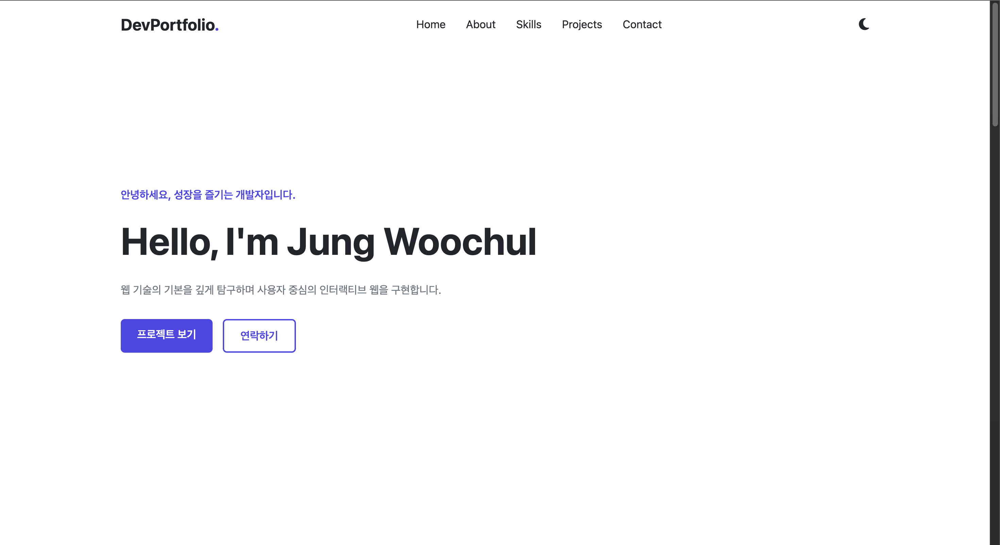
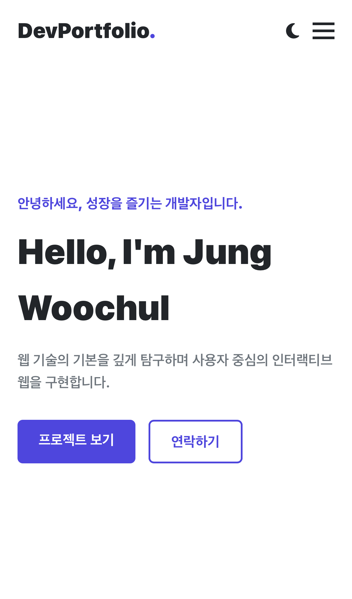
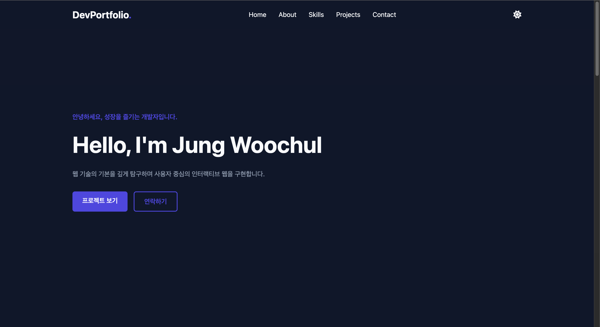
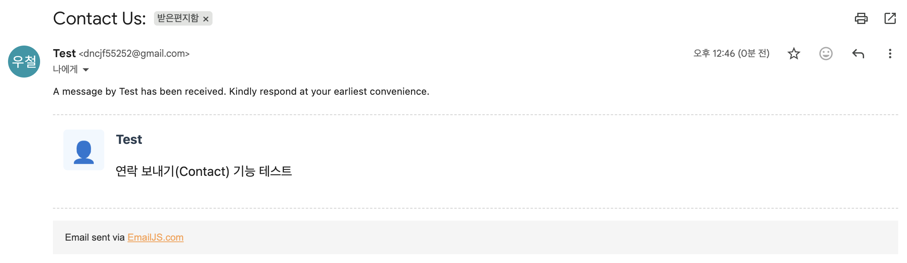

## 나를 소개하는 웹페이지 처음부터 만들기
- JS / Web Development 과제 요구사항을 완벽히 준수하여 순수 바닐라 자바스크립트(ES6+)와 최신 웹 표준 기술만으로 제작한 반응형 개인 포트폴리오 웹사이트입니다.
- 외부 프레임워크(React 등) 없이 "사용자 이벤트 → 상태 변경(State) → DOM 렌더링" 흐름을 단일 상태 객체 기반으로 명확하게 추상화하여 구현했습니다.

### 배포 링크 및 개요
- 배포 URL: [https://woochul0516.github.io/Portfolio_Web/]
- GitHub 저장소: [https://github.com/woochul0516/AI_Learning_Tool/tree/main/B1-1]

### 사용 기술 및 개발 환경 (Tech Stack)
- Language: `HTML5` (시맨틱 마크업), `CSS3`, `JavaScript (ES6+)`
- API / Service: `GitHub REST API`, `EmailJS Browser SDK`
- Icons & Fonts: `Font Awesome Icons`, `Google Fonts`
- Environment: `VS Code`, `Live Server`, `GitHub Pages`

### 주요 기능 및 미션 요구사항 충족 내역
1. 상태 관리 패턴 (State Management)
단일 상태 객체 (state) 구현: `theme`, `repos`, `filter`, `loading`, `error`, `formErrors` 상태를 하나의 중앙 객체로 관리하여 UI와 완벽하게 동기화했습니다.

상태 객체 예시:
```javascript
const state = {
  theme: localStorage.getItem('theme') || 'light',
  repos: [],
  filter: 'all',
  loading: false,
  error: null,
  formErrors: {}
};
```

상태-렌더링 연결 사례:
- 다크 모드: 버튼 클릭 → `state.theme` 변경 → `DOM attributes` 및 `localStorage` 반영
- GitHub API: `Fetch` 시작/성공/실패 → `state.loading` / `error` / `repos 변경` → Projects UI 상태별 차등 렌더링
- 프로젝트 필터링: 언어 클릭 → `state.filter` 변경 → 배열 `.filter()` 후 카드 재렌더링
- 폼 유효성 검사: 제출 → `state.formErrors` 업데이트 → 에러 메시지 DOM 반영

2. 시맨틱 HTML & CSS 레이아웃
`<header>`, `<nav>`, `<main>`, `<section>`, `<article>`, `<footer>` 시맨틱 태그만을 사용하여 구조를 설계했습니다.

- Flexbox & Grid 조합:
    - `Navigation` & `Header`: `Flexbox` 적용 (`.nav-container`, `.header-actions`, `.nav-list`)으로 1차원 요소 배치 및 정렬
    - Projects & Skills Section: `CSS Grid` 기반의 반응형 카드 레이아웃 `(grid-template-columns: repeat(auto-fit, minmax(200px, 1fr)), minmax(280px, 1fr))`
- CSS Custom Properties (:root) & 다크 모드:
    - `--bg-primary`, `--bg-secondary`, `--bg-card`, `--text-primary`, `--accent-color` 등 CSS 변수를 선언
    - `[data-theme="dark"]` 선택자를 이용한 테마 스위칭 및 transition 효과 적용
- 모바일 퍼스트 반응형 디자인:
    - 미디어 쿼리 브레이크포인트 (768px, 1024px) 설정
    - `#hamburger` 클릭 시 `.nav-menu.active` 토글을 통한 모바일 드로어 메뉴 구현 (768px 이상에서는 `Desktop Nav` 자동 전환)

3. GitHub REST API 연동 및 상태별 UI
- async/await 및 fetch를 활용하여 https://api.github.com/users/woochul0516/repos?sort=updated&per_page=10 데이터를 수신하고 API 403 Rate Limit 예외 처리 및 try...catch 에러 핸들링을 적용했습니다.

- 4가지 UI 상태 완벽 대응:
    - 로딩 상태: `@keyframes spin` 기반의 `.spinner` 애니메이션 및 안내 메시지 표시 `(state.loading = true)`
    - 성공 상태: `Array.prototype.map`, 구조 분해 할당`({ name, description, html_url, stargazers_count, language })`, 템플릿 리터럴을 활용해 동적 카드 `.project-card` 렌더링
    - 에러 상태: `.error-msg` 출력 및 `#retry-btn` 클릭 시 `fetchGitHubRepos()` 재요청 기능 제공
    - 빈 데이터 상태: 조건 만족 프로젝트 부재 시 안내 메시지 출력 `(filteredRepos.length === 0)`

4. Contact Form 유효성 검사 및 실제 메일 발송 (EmailJS 연동)
    - `e.preventDefault()`를 통한 기본 폼 제출 방지
    - 이름(username), 메시지(message) 필수 입력값 검증 및 정규표현식`(/^[^\s@]+@[^\s@]+.[^\s@]+$/)`을 활용한 이메일(email) 포맷 유효성 검사
    - 보너스 미션 달성 (EmailJS): `External CDN (@emailjs/browser@3)` 연결 및 `emailjs.send(EMAILJS_SERVICE_ID, EMAILJS_TEMPLATE_ID, {...})` 호출로 백엔드 없이 지정된 이메일함으로 실시간 전송
    - 메일 전송 중 버튼 비활성화 `(submitBtn.disabled = true, textContent = '전송 중...')` 및 `#form-success` 영역을 통한 성공/실패 메시지 UX 처리

5. UI 인터랙션 및 애니메이션
    - 타이핑 효과 (보너스 미션): `initTypingEffect()` 함수로 `Hero` 섹션의 `#typing-text` 요소에 자바스크립트 기반 타자기 효과 구현 `(Jung Woochul)`
    - 프로젝트 카테고리 필터링 (보너스 미션): `e.target.dataset.filter` 값을 읽어 `Array.prototype.filter` 기반 기술 언어별 카드 스크리닝
    - Intersection Observer API: `initScrollAnimation()`을 통해 `.fade-in-section` 클래스를 관찰하여 스크롤 시 `is-visible` 클래스 추가 `(opacity: 1, transform: translateY(0))`
    - 스크롤 UX: 스크롤 60px 이상 시 헤더 그림자 및 배경 처리 `(#header.scrolled)`, 스크롤 300px 이상 시 상단 이동 버튼 노출 `(#scroll-top.show)` 및 클릭 시 `window.scrollTo({ top: 0, behavior: 'smooth' })` 동작


### 프로젝트 구조 (Directory Structure)
```text
├── index.html          # 시맨틱 구조 마크업 및 외부 스크립트(EmailJS, FontAwesome) 연결
├── css/
│   └── style.css       # CSS 변수, 다크모드, Flex/Grid 및 반응형 스타일
└── js/
└── main.js         # 상태 관리, DOM 이벤트, API 연동, EmailJS 핵심 로직
```


### 프로젝트 실행 화면 (Screenshots)
| 화면 구분 | 설명 | 이미지 |
| :--- | :--- | :--- |
| **데스크톱 (Desktop)** | 메인 화면 및 카드 레이아웃 |  |
| **모바일 & 햄버거 메뉴** | 반응형 모바일 메뉴 동작 화면 |  |
| **다크 모드 (Dark Mode)** | 다크 테마 적용 화면 |  |
| **이메일 수신 (Contact Mail)** | EmailJS를 통해 실제 수신된 문의 메일 |  |

### 학습 및 성찰 (Mission Takeaways)
- 시맨틱 마크업의 이유: `header`, `main`, `article`, `section` 등의 시맨틱 태그를 명확히 구분하여 작성함으로써 웹 접근성(A11y) 향상과 검색엔진 최적화(SEO)의 중요성을 체득했습니다.
- Flexbox vs Grid: `Navigation`과 `Header Actions` 구조에서는 1차원 레이아웃 정렬을 위해 Flexbox를 사용하고, Skills 및 Projects 카드 영역에는 2차원 반응형 배치를 위해 CSS Grid를 선택하여 효용성을 확인했습니다.
- 상태 관리의 체득: 사용자 이벤트 발생 시 DOM을 직접 난잡하게 변경하는 대신, 단일 상태 객체(`state`)를 업데이트하고 상태에 맞게 DOM을 렌더링하는 순수 바닐라 JS 기반의 상태 중심 설계 원리를 익혔습니다.